# Vector Search PoC

This repository contains the Proof of Concept (PoC) code for a vector search implementation using Apache Solr.

## Directory Configuration

```
vector_search_poc
├── Readme.md
├── data_downloader
│   ├── config.env
│   ├── json_parser.sh
│   └── solr_documents.py
├── data_encoder
│   ├── README.md
│   ├── __pycache__
│   │   ├── products.cpython-310.pyc
│   │   └── text_preprocessor.cpython-310.pyc
│   ├── create_dataset.py
│   ├── data
│   │   ├── Archive.zip
│   │   ├── data-1.json.zip
│   │   ├── data-2.json.zip
│   │   ├── data-3.json.zip
│   │   ├── data-4.json.zip
│   │   ├── data-5.json.zip
│   │   ├── data-6.json.zip
│   │   ├── data-7.json.zip
│   │   ├── data-8.json.zip
│   │   ├── data-9.json.zip
│   │   ├── inflated_data
│   │   │   ├── data-1.json
│   │   │   ├── data-2.json
│   │   │   ├── data-3.json
│   │   │   ├── data-4.json
│   │   │   ├── data-5.json
│   │   │   ├── data-6.json
│   │   │   ├── data-7.json
│   │   │   ├── data-8.json
│   │   │   └── data-9.json
│   │   ├── products-vectors-data-1.json
│   │   ├── products-vectors-data-2.json
│   │   ├── products-vectors-data-3.json
│   │   ├── products-vectors-data-4.json
│   │   ├── products-vectors-data-5.json
│   │   ├── products-vectors-data-6.json
│   │   ├── products-vectors-data-7.json
│   │   ├── products-vectors-data-8.json
│   │   └── products-vectors-data-9.json
│   ├── data_sanity.py
│   ├── products.py
│   ├── query_vector.py
│   ├── requirements.txt
│   └── text_preprocessor.py
└── solr
    └── conf
        ├── retail-collection-vector
        │   ├── configoverlay.json
        │   ├── lang
        │   │   ├── contractions_ca.txt
        │   │   ├── contractions_fr.txt
        │   │   ├── contractions_ga.txt
        │   │   ├── contractions_it.txt
        │   │   ├── hyphenations_ga.txt
        │   │   ├── stemdict_nl.txt
        │   │   ├── stoptags_ja.txt
        │   │   ├── stopwords_ar.txt
        │   │   ├── stopwords_bg.txt
        │   │   ├── stopwords_ca.txt
        │   │   ├── stopwords_cz.txt
        │   │   ├── stopwords_da.txt
        │   │   ├── stopwords_de.txt
        │   │   ├── stopwords_el.txt
        │   │   ├── stopwords_en.txt
        │   │   ├── stopwords_es.txt
        │   │   ├── stopwords_et.txt
        │   │   ├── stopwords_eu.txt
        │   │   ├── stopwords_fa.txt
        │   │   ├── stopwords_fi.txt
        │   │   ├── stopwords_fr.txt
        │   │   ├── stopwords_ga.txt
        │   │   ├── stopwords_gl.txt
        │   │   ├── stopwords_hi.txt
        │   │   ├── stopwords_hu.txt
        │   │   ├── stopwords_hy.txt
        │   │   ├── stopwords_id.txt
        │   │   ├── stopwords_it.txt
        │   │   ├── stopwords_ja.txt
        │   │   ├── stopwords_lv.txt
        │   │   ├── stopwords_nl.txt
        │   │   ├── stopwords_no.txt
        │   │   ├── stopwords_pt.txt
        │   │   ├── stopwords_ro.txt
        │   │   ├── stopwords_ru.txt
        │   │   ├── stopwords_sv.txt
        │   │   ├── stopwords_th.txt
        │   │   ├── stopwords_tr.txt
        │   │   └── userdict_ja.txt
        │   ├── managed-schema.xml
        │   ├── protwords.txt
        │   ├── solrconfig.xml
        │   ├── stopwords.txt
        │   ├── synonyms.txt
        │   └── zknode.data
        ├── solr_indexer.py
        └── solr_query.py
```

## Configuration Diagram

```mermaid
graph TD;
    A[vector_search_poc] --> B[Readme.md];
    A --> C[data_downloader];
    C --> D[config.env];
    C --> E[json_parser.sh];
    C --> F[solr_documents.py];
    A --> G[data_encoder];
    G --> H[README.md];
    G --> I[__pycache__];
    I --> J[products.cpython-310.pyc];
    I --> K[text_preprocessor.cpython-310.pyc];
    G --> L[create_dataset.py];
    G --> M[data];
    M --> N[Archive.zip];
    M --> O[data-1.json.zip];
    M --> P[data-2.json.zip];
    M --> Q[data-3.json.zip];
    M --> R[data-4.json.zip];
    M --> S[data-5.json.zip];
    M --> T[data-6.json.zip];
    M --> U[data-7.json.zip];
    M --> V[data-8.json.zip];
    M --> W[data-9.json.zip];
    M --> X[inflated_data];
    X --> Y[data-1.json];
    X --> Z[data-2.json];
    X --> AA[data-3.json];
    X --> AB[data-4.json];
    X --> AC[data-5.json];
    X --> AD[data-6.json];
    X --> AE[data-7.json];
    X --> AF[data-8.json];
    X --> AG[data-9.json];
    M --> AH[products-vectors-data-1.json];
    M --> AI[products-vectors-data-2.json];
    M --> AJ[products-vectors-data-3.json];
    M --> AK[products-vectors-data-4.json];
    M --> AL[products-vectors-data-5.json];
    M --> AM[products-vectors-data-6.json];
    M --> AN[products-vectors-data-7.json];
    M --> AO[products-vectors-data-8.json];
    M --> AP[products-vectors-data-9.json];
    G --> AQ[data_sanity.py];
    G --> AR[products.py];
    G --> AS[query_vector.py];
    G --> AT[requirements.txt];
    G --> AU[text_preprocessor.py];
    A --> AV[solr];
    AV --> AW[conf];
    AW --> AX[retail-collection-vector];
    AX --> AY[configoverlay.json];
    AX --> AZ[lang];
    AZ --> BA[contractions_ca.txt];
    AZ --> BB[contractions_fr.txt];
    AZ --> BC[contractions_ga.txt];
    AZ --> BD[contractions_it.txt];
    AZ --> BE[hyphenations_ga.txt];
    AZ --> BF[stemdict_nl.txt];
    AZ --> BG[stoptags_ja.txt];
    AZ --> BH[stopwords_ar.txt];
    AZ --> BI[stopwords_bg.txt];
    AZ --> BJ[stopwords_ca.txt];
    AZ --> BK[stopwords_cz.txt];
    AZ --> BL[stopwords_da.txt];
    AZ --> BM[stopwords_de.txt];
    AZ --> BN[stopwords_el.txt];
    AZ --> BO[stopwords_en.txt];
    AZ --> BP[stopwords_es.txt];
    AZ --> BQ[stopwords_et.txt];
    AZ --> BR[stopwords_eu.txt];
    AZ --> BS[stopwords_fa.txt];
    AZ --> BT[stopwords_fi.txt];
    AZ --> BU[stopwords_fr.txt];
    AZ --> BV[stopwords_ga.txt];
    AZ --> BW[stopwords_gl.txt];
    AZ --> BX[stopwords_hi.txt];
    AZ --> BY[stopwords_hu.txt];
    AZ --> BZ[stopwords_hy.txt];
    AZ --> CA[stopwords_id.txt];
    AZ --> CB[stopwords_it.txt];
    AZ --> CC[stopwords_ja.txt];
    AZ --> CD[stopwords_lv.txt];
    AZ --> CE[stopwords_nl.txt];
    AZ --> CF[stopwords_no.txt];
    AZ --> CG[stopwords_pt.txt];
    AZ --> CH[stopwords_ro.txt];
    AZ --> CI[stopwords_ru.txt];
    AZ --> CJ[stopwords_sv.txt];
    AZ --> CK[stopwords_th.txt];
    AZ --> CL[stopwords_tr.txt];
    AZ --> CM[userdict_ja.txt];
    AX --> CN[managed-schema.xml];
    AX --> CO[protwords.txt];
    AX --> CP[solrconfig.xml];
    AX --> CQ[stopwords.txt];
    AX --> CR[synonyms.txt];
    AX --> CS[zknode.data];
    AV --> CT[solr_indexer.py];
    AV --> CU[solr_query.py];
```

